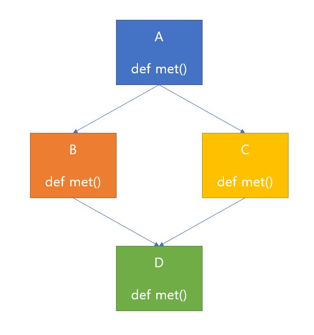

## MRO(Method Resolution Order)란?

- MRO는 파이썬의 상속과 관련있는 개념입니다. 파이썬은 기본적으로 다중 상속을 지원합니다.
- 상속받은 부모 클래스가 서로 겹치지 않는 메소드 네임을 가지고 있다면 문제될 것이 없습니다.
- 하지만 만약 부모 클래스들이 똑같은 이름의 메소드를 가지고 있다면 죽음의 다이아몬드(the Deadly Diamond of Death) 문제가 발생하게 됩니다.
- 죽음의 다이아몬드는 다중 상속을 받을 때, 부모 클래스에 동일한 이름의 메소드를 호출하려 할 때 어떤 부모의 메소드를 호출해야 할 지 모르기 때문에 발생하는 문제입니다.
- 파이썬은 MRO를 통해 이 문제를 해결합니다. MRO는 자식과 부모 클래스를 전부 포함하여 메소드의 실행 순서를 지정하는 것입니다.

### 다중상속 예제

```python
class A:
    def met(self):
        print('A')


class B(A):
    def met(self):
        print('B')


class C(A):
    def met(self):
        print('C')


class D(B, C):
    def met(self):
        print('D')
```

- 우선 최상위 클래스인 A를 선언하고, A를 상속받은 B, C 클래스를 선언했습니다.
- 마지막으로 B, C 클래스를 상속받는 D 클래스를 선언했습니다.
- 또한 각 클래스는 met 메소드를 가지고 있습니다.
- 현재 상황을 그림으로 나타내면 다음과 같습니다.



모든것을 상속받은 D 클래스의 MRO를 확인해 보면 다음과 같습니다.

```python
(<class '__main__.D'>, <class '__main__.B'>, <class '__main__.C'>, <class '__main__.A'>, <class 'object'>)
```

- 먼저 출력된 값일수록 우선 순위가 높습니다.
- D -> B -> C -> A -> object 클래스 순서로 우선순위를 가집니다.

```python
d = D()
d.met()

>>>
# 출력결과
D
```

- D의 인스턴스를 만들어서 met 메소드를 호출하면 D 클래스의 met이 호출되는 것을 확인할 수 있습니다.

```python
class A:
    def met(self):
        print('A')


class B(A):
    def met(self):
        print('B')


class C(A):
    def met(self):
        print('C')


class D(B, C):
    pass

d = D()
d.met()

>>>
B
```

- D 클래스의 met 메소드를 삭제하면 그 다음 우선순위를 가지는 B 클래스의 메소드가 실행됩니다.
- 만약 D(C, B) 순으로 상속했다면 C 클래스의 메소드가 실행됩니다.

### super 클래스와 MRO

위의 예제코드를 변형해서 super 클래스와 MRO의 관계를 알아보겠습니다.

```python
class A:
    def met(self):
        print('A')


class B(A):
    def met(self):
        print('B')
        super().met()


class C(A):
    def met(self):
        print('C')


class D(C, B):
    pass

print(D.__mro__)
d = D()
d.met()

>>>
B
C
```

- B 클래스의 메소드가 super클래스의 met() 메소드를 호출합니다.
- B 클래스의 부모는 A 클래스이므로 'B','A'를 출력하지 않을까 싶지만 결과는 'B', 'C'를 출력합니다.

```python
print(D.__mro__)
(<class '__main__.D'>, <class '__main__.B'>, <class '__main__.C'>, <class '__main__.A'>, <class 'object'>)
```

- D 클래스의 MRO는 위와 같고, MRO에 의해 B 클래스의 super 클래스가 다음 우선순위를 가지는 C 클래스를 가리키게 되는 것입니다.

### TypeError: Cannot create a consistent method resolution order (MRO)

- MRO를 정상적으로 생성할 수 없을 경우 오류를 발생시킵니다.
- 메소드의 순서를 정할 수 없는 모순적인 상황에 발생합니다.

```python
class A:
    pass

class B(A):
    pass

class C(A):
    pass

class D(A, B, C): # 에러 발생!
    pass
```

- B와 C 클래스 모두 A 클래스를 상속받는데 D 클래스가 A 클래스를 먼저 상속받은 상황입니다.
- A 클래스가 MRO상 우선순위를 가지게 되야 하는데 뒤의 B 클래스와 C 클래스가 A를 상속받고 있어 모순적인 상황이므로 에러가 발생합니다.

```python
class A:
    pass

class B:
    pass

class C(A, B):
    pass

class D(B, A):
    pass

class E(C, D): # 에러 발생!
    pass
```

- E 클래스가 C, D 클래스를 상속받는데 C와 D 클래스가 각각 교차된 순서로 부모에게서 상속을 받고 있습니다.
- E 클래스에서 우선순위를 정할 수 없기 때문에 에러가 발생합니다.(단, 중복은 허용됩니다).
